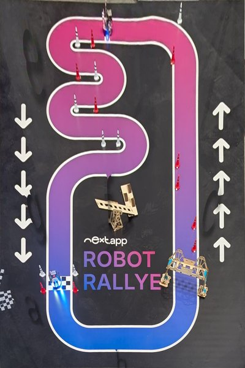
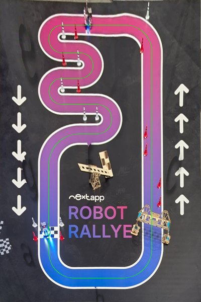

# The track

The Robot Rallye mat, measured from a phone photo taken at the venue on 7 Oct 2026. The mat
finder located the mat's corners in the photo, the photo was rectified to a top-down view, and
the lane positions, corner radii and hairpins were measured on it. The route drawn on that view
follows the lane all the way round:

| Top-down view of the mat | The measured route on it |
| --- | --- |
|  |  |

## Coordinates

Centimetres, as seen **standing at the near end (side b)**: the mat is 200 wide (x, left to
right) and 300 deep (y, far end to near end), origin at the far-left corner. Headings are
`atan2(dy, dx)`: 0 = right, 90 = towards you (down the page), and a right turn makes the heading
grow.

## Layout

- Lane 18 cm wide with 2 cm white borders; the lane shades from blue (near end) to pink (far end).
- Lane centres: left side x = 48.5, right side x = 151.2, near straight y = 276.1, far straight
  y = 25. The zigzag's lanes are at y = 52.5, 78, 103.5 and 133.2.
- 90° corners have a centre-line radius of 25–30 cm; the four hairpins of the zigzag 12.75–14.85 cm.
- Start/finish: the checkered line across the left side at y ≈ 230.5. The lap starts there
  driving towards side b (section a) and ends at the same line.
- The bridge spans the right side at y ≈ 205–242. The robot drives under it; the camera loses the
  robot's lights there for about a second.
- Cones on the right side (section c): two on the right half of the lane at y ≈ 186–205, then two
  on the left half at y ≈ 136–154. The route shifts 2.5 cm left past the first pair and 3.5 cm
  right past the second.

## Sections (the track code)

As described at the venue: start between g and a, drive towards a. In the code
([`rally-lab/src/core/race/route.ts`](../rally-lab/src/core/race/route.ts), `RALLY_ROUTE`) each
section is a list of straights and turns. **Straight lengths are the straight parts only**, between
the curves; the venue measurements of a lane's whole length include its curves, which is why
they are longer.

| Section | Venue description | Track code |
| --- | --- | --- |
| a | ~30 cm, 90° left | straight 20.2, left 90° r 25.4 |
| b | ~85 cm, 90° left | straight 48.3, left 90° r 29 |
| c | ~200 cm, bridge, cones right then left, 90° left | straight 195.6 (offsets −2.5 at 37–71, +3.5 at 88–121), left 90° r 26.5 |
| d | ~85 cm, 180° left | straight 62.45, left 180° r 13.75 |
| e | zigzag: 40, 180° right, 40, 180° left | straight 17.5, right 180° r 12.75, straight 18.25, left 180° r 12.75 |
| f | zigzag: 60, 180° right, 60, 90° left | straight 34.65, right 180° r 14.85, straight 17.65, left 90° r 30 |
| g | ~90 cm to the finish | straight 67.3 |

The lap is 825 cm with arc turns. With spin turns it is a little longer (the robot drives to where
two straights meet and turns on the spot there; turns are cut into 45° spins so those corners stay
within ~2 cm of the lane centre).

The track code can be edited in the app (Auto → Track code) without a new build; **Copy track
code** puts the edited version on the clipboard. A test (`src/core/race/venue.test.ts`) checks
that the route runs on the painted lane of the venue photo.
